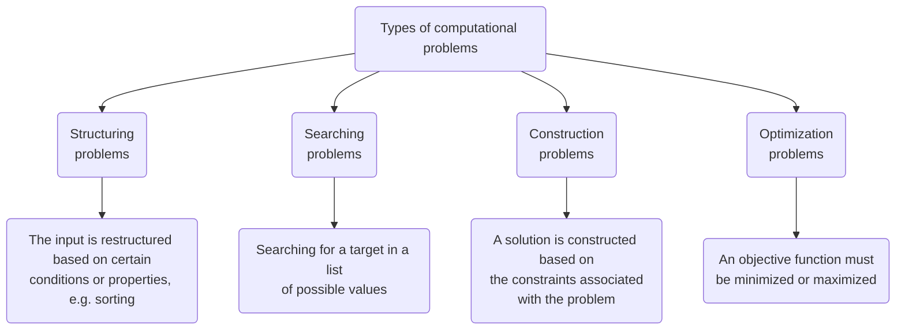

## What Is Computer Science?

Computer science is the systematic study of algorithms and data structures — specifically their formal properties, their mechanical and linguistic realizations, and their applications.

| Aspect | What it covers |
| --- | --- |
| **Formal and mathematical properties** | Study of algorithm correctness, design, and analysis |
| **Hardware realization** | Computer hardware |
| **Linguistic realization** | Programming languages and their design, translators such as interpreters and compilers, and system software tools such as linkers and loaders |
| **Applications** | Design and development of efficient software and tools so that algorithms can be used to solve specific problems |

## Computational vs. Non-Computational Problems

### Computational Problems

A computational problem is one that can be solved by a computer. It has two characteristics:

1. A **formalization** of all legal inputs and the expected outputs of the problem.
2. A **characterization** of the relationship between the input and the output.

An algorithm is therefore expected to produce an output for every legal input. If an algorithm yields the correct output for every legal input, it is called an **algorithmic solution**.

### Non-Computational Problems

These are problems that cannot be solved by computers, such as those involving opinions or other subjective judgments.

### Types of Computational Problems

## Characteristics of an Algorithm

- **Input:** An algorithm has zero or more inputs.
- **Output:** An algorithm produces at least one output, or a change in its inputs (called a *side effect*).
- **Definiteness:** Every instruction must be clear and unambiguous.
- **Uniqueness:** An algorithm is a well-defined, ordered procedure consisting of a set of instructions in a specific order.
- **Correctness:** The algorithm must produce the correct result.
- **Effectiveness:** Each step should be simple enough to be traced manually.
- **Finiteness:** The algorithm must terminate after executing a finite number of steps.
- **Simplicity:** The algorithm should be easy to understand and implement.
- **Generality:** The algorithm should work for a whole class of problems, not just a single instance.

## Fundamentals of Problem Solving

### 1. Understanding the Problem

First, determine whether the problem is solvable at all — this is the domain of *computability theory*. Working through small numerical instances of a problem often gives useful insight into it.

### 2. Planning the Algorithm

- **Model of computation:** We need an abstract model of computation that defines the environment in which the algorithm runs. Two common models are the **RAM (Random Access Machine)** and the **Turing machine**.
- **Data organization:** The nature of the data and how it is organized can have a significant impact on an algorithm's efficiency.

### 3. Designing the Algorithm

The design strategy differs from problem to problem. Simulating the problem exactly as it is stated is called a **brute-force** solution. Better strategies include **divide and conquer**, **dynamic programming**, **greedy algorithms**, and **backtracking**.

### 4. Algorithm Specification

A designed algorithm must be communicated to the programmer who will implement it; this is called *algorithm specification*. **Pseudocode** is the most common choice, because natural language is ambiguous and actual code can add unnecessary complexity for the reader.

### 5. Validating and Verifying the Algorithm

- **Validation:** Checking whether the algorithm produces the correct output.
- **Verification:** Providing a mathematical proof that the algorithm correctly maps every valid input to its expected output for the given problem.

### 6. Analyzing the Algorithm

Analysis means determining the efficiency of an algorithm, so that two algorithms for the same problem can be compared to find out which one is better.

### 7. Implementation and Empirical Analysis

Complexity analysis performed on an actual running program is called **empirical analysis**.

### 8. Postmortem Analysis

Finding the algorithm's breaking points, checking whether the solution is optimal, measuring its efficiency, and identifying room for further optimization.

## Classification of Algorithms

### Based on Implementation

- **Recursive:** The problem is reduced repeatedly until the reduced problem can be solved directly; that problem is called the **base case**. The solution to the larger problem is then built up from it.
- **Non-recursive (iterative):** The algorithm deduces a partial result at every step.

### Based on the Number of Processors

- **Sequential algorithms** are written for a single processor.
- **Parallel algorithms** are written for multiple processors.

### Exact vs. Approximation

Some problems do not have an efficient exact solution, so we use **approximation algorithms** instead.

### Deterministic vs. Non-Deterministic

- **Deterministic:** Produces a fixed, predictable result.
- **Non-deterministic (randomized):** Uses random numbers, so results may vary between runs.

### Based on Design Technique

Algorithms can be grouped by the design technique they use, such as brute force, dynamic programming, greedy, and branch and bound.

### Based on Area of Specialization

- **General algorithms**
- **Domain-specific algorithms**, such as string algorithms and graph algorithms

### Based on Tractability

- **Easily solvable:** Problems that can be solved efficiently.
- **Unsolvable:** Problems that no algorithm can solve.
- **Intractable:** Problems that have a solution, but it requires so many computing resources that it is practically impossible to implement for large inputs. The **Travelling Salesman Problem (TSP)** is a classic example; such problems are believed to be inherently hard.
